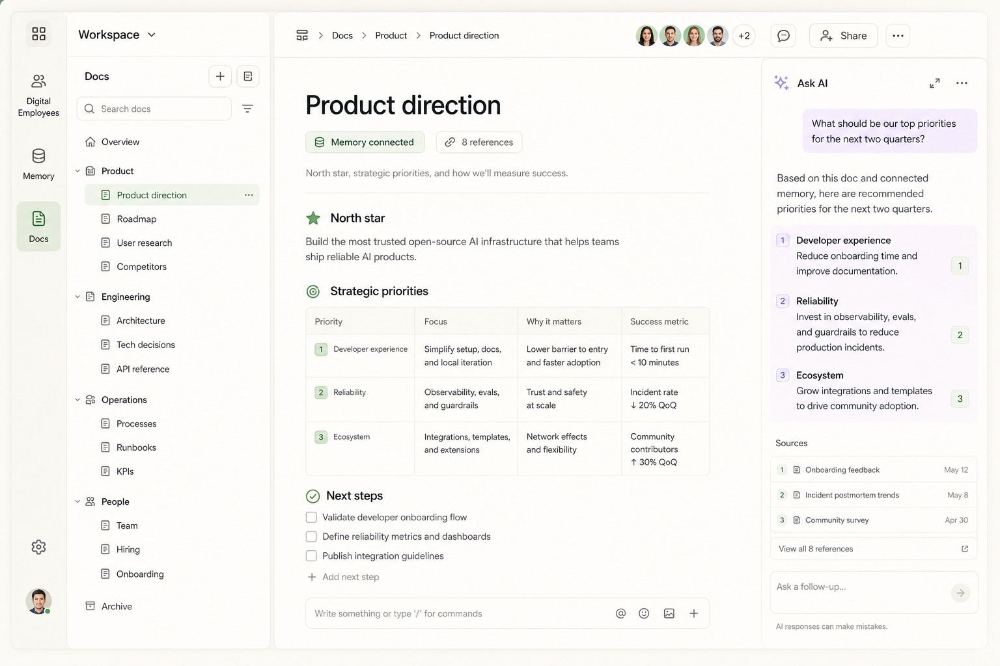

# ADR 0001: Warm Agent Workspace visual language

- Status: Superseded by [ADR 0002](./0002-antd-design-language.md)
- Date: 2026-08-02
- Decision owners: ByteFolk maintainers
- Tracks: [issue #1](https://github.com/bytefolk/design-system/issues/1)

## Context

Docs, Memory, and future Digital Employee Web applications need to feel like one product family
without coupling their business logic. Candidate C, “Warm Agent Workspace,” was selected because it
combines the calm writing surface of a document tool with visible, trustworthy AI and source states.

This image is a direction reference, not a pixel specification. The shipped React components,
semantic tokens, responsive behavior, and accessibility tests are the source of truth. When the
reference and an accessible implementation conflict, the accessible implementation wins.

## Decision

We publish one product-neutral package, `@fullstack-ai-infra/ui`, with semantic CSS tokens, a
Tailwind preset, accessible React primitives, and application-shell patterns.

### Palette contract

Light is the default direction. Dark mode keeps the same semantic names and changes only values.

| Role       | Light anchor         | Rule                                                     |
| ---------- | -------------------- | -------------------------------------------------------- |
| Canvas     | warm ivory `#f5f1e8` | Page background, never pure white                        |
| Navigation | stone `#e6e1d7`      | Module rail and navigation structure                     |
| Surface    | paper `#fbf9f4`      | Content cards and writing surfaces                       |
| Foreground | charcoal `#282925`   | Primary text and high-contrast controls                  |
| Primary    | sage `#5f735e`       | Human actions, active navigation, focus family           |
| AI         | lavender `#7568a8`   | AI-generated, AI-working, and AI-action affordances only |

Consumers use semantic variables such as `--ui-surface` and `--ui-ai`; they must not copy these
hex values. Lavender must not become a general brand accent. Warning, danger, success, source, and
AI states keep separate meanings.

### Density and spacing

The default density is calm-compact: 38px controls, 60px top bars, 72px module rails, and a 4px
spacing base. Content gets generous vertical whitespace while navigation remains information dense.
Touch targets that are expected on mobile must reach 44px through the large size or consumer layout.

### Radius and elevation

Controls use 6–10px radii, cards 14px, feature surfaces 18px, and identity/status marks may be fully
round. Shadows are quiet and secondary to borders. Modal elevation is the only strong shadow tier.

### Typography

The system uses the native/interoperable sans stack headed by Inter. Product surfaces use 13–15px
body text and restrained headings. Code, shortcuts, identifiers, and timestamps use the system mono
stack. Consumer products own long-form editor typography.

### Icons and motion

Lucide is the default icon family. Icons accompany accessible text or carry an explicit accessible
name when used alone. Product-specific icon packs need a separate decision.

Motion uses 120ms and 180ms semantic durations. `prefers-reduced-motion: reduce` collapses design
system durations to zero and disables decorative animation.

### Accessibility

Keyboard focus, semantic landmarks, accessible names, contrast, dark theme, and reduced motion are
part of the component contract. Radix primitives provide the behavioral foundation for overlays and
menus; repository tests verify observable keyboard behavior and automated accessibility rules.

## Boundaries

- Routing, authentication, i18n, editors, persistence, and domain data stay in consumer repositories.
- React and React DOM remain peer dependencies. Runtime-only packages do not consume this package.
- Business repositories do not recreate primitives or introduce raw brand colors after migration.
- The showcase may use product nouns to prove the shared shell; exported package code stays neutral.

## Consequences

Consumers gain one interaction language and can migrate incrementally. The semantic token contract
is stable; visual values can evolve without changing consumer class names. New primitives require
observable tests and must work in both themes. Exceptions need an issue and design-system review.
